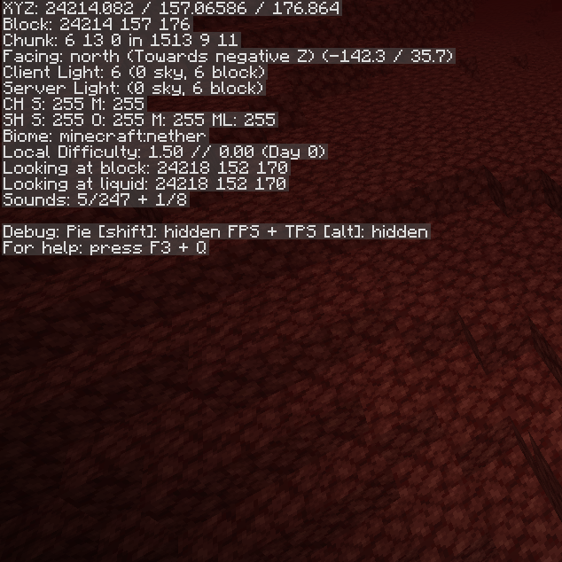

# netherHigher [![][release-badge]][releases-link] [![][cf-downloads-badge]][cf-link] [![][cf-available-badge]][cf-link]
*Increases the nether height limit to 256.*
## Licensing
netherHigher is licensed under [MIT](LICENSE). 

netherHigher bundles [Fiber][fiber], which is licensed under [Apache v2](LICENSE-FIBER).
## Notice
Past and recent developments regarding the Fabric mod loader and its community and management have led me to believe the project is doomed. Having already lost interest in Minecraft modding and Minecraft itself long ago, I have no interest in keeping up with project splits or forks. As such, I have no plans to continue development of any of my mods for the foreseeable future.

[fiber]: https://github.com/DaemonicLabs/fiber
[release-badge]: https://img.shields.io/github/v/release/geniiii/netherHigher?include_prereleases
[cf-downloads-badge]: http://cf.way2muchnoise.eu/netherhigher.svg
[cf-available-badge]: http://cf.way2muchnoise.eu/versions/netherhigher.svg
[cf-link]: https://www.curseforge.com/minecraft/mc-mods/netherhigher
[releases-link]: https://github.com/geniiii/netherHigher/releases
